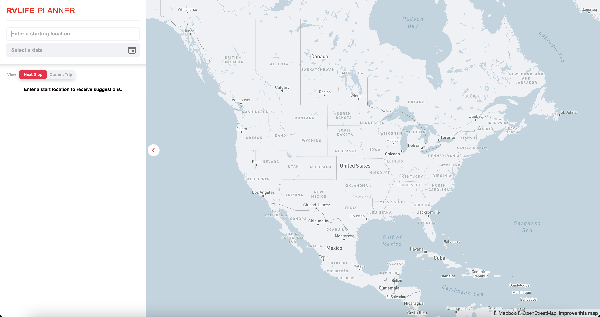
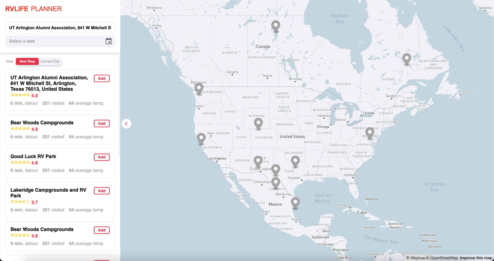

## RVLife Planner

#### Description:

This is application is intended to help RV travelers plan their trips, one stop at a time.

## Project Status

This project is currently in development. Users can navigate around the map (via the MapBox API) as well as type in their start destinations. Functionality of the machine learning model is still in progress.

## Project Screen Shots

## Installation and Setup Instructions

Clone down this repository. You will need `node`, `npm`, Python, and `pipenv` installed globally on your machine.

### !!! IMPORTANT !!!

#### You must set up the frontend and backend SEPARATELY in their respective directories.

### Frontend Setup:

Navigate INTO the frontend/ directory. Then, follow these [steps to set up the frontend](/frontend/README.md "Frontend setup").

### Backend Setup:

Navigate INTO the backend/ directory. Then, follow these [steps to set up the backend](/backend/README.md "Backend setup").

## Usage

Enter any destination you wish to start your trip from, and select a suggested location that best aligns with your intended start point.

From there, a list of suggested next destinations should appear below the "View" toggle button. Select any of the suggested destinations from either the list or the map to view more about it.

Choose one option among the list of suggested next destinations to add the stop to your current trip. After doing so, a new list of next destinations will be suggested based on where your most recent stop is.

You can view information about your current trip, such as the stops and total duration, by toggling the "View" button.

Repeat this process with as many stops as you would like until you are satisifed with your trip.
